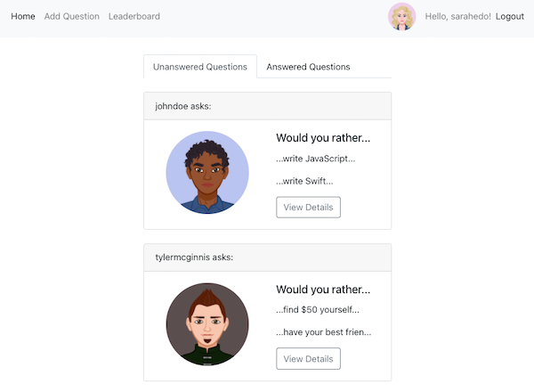

# Would You Rather?

## About

An online version of the popular "Would You Rather?" game. Users are able to create and answer questions, see results for questions they have answered already, and see the ranking of users on the leaderboard. Admins are also able to delete questions.



## Motivation

The frontend part of the project is part of [Udacity's React Nanodegree program](https://www.udacity.com/course/react-nanodegree--nd019). The backend was added to persist data.

## Technologies

MERN. MongoDB, Express, Node, React, Redux, Reactstrap.

## Installation Instructions

```
$ git clone https://github.com/HannaEb/would-you-rather.git
```

Open 3 different tabs, in the first tab:

```
$ brew services start mongodb-community
```

Second tab:

```
$ cd would-you-rather
$ npm install
$ npm start
```

Third tab:

```
$ cd would-you-rather
$ npm install
$ node server.js
```

## Author

HannaEb
