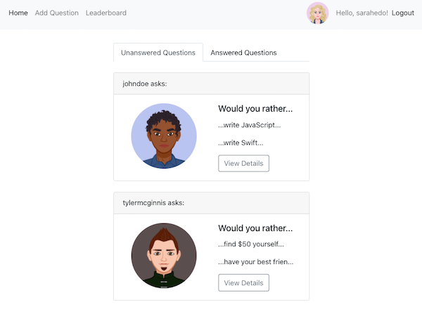

# Would You Rather?

## About

An online version of the popular "Would You Rather?" game. Users are able to answer questions, see results for questions they have answered already, add new questions, and see the ranking of users on the leaderboard.



## Motivation

This project is part of [Udacity's React Nanodegree program](https://www.udacity.com/course/react-nanodegree--nd019).  

## Technologies

React, Redux, Bootstrap, Reactstrap.

## Installation Instructions

```
$ git clone https://github.com/HannaEb/would-you-rather.git
$ cd would-you-rather
$ npm install
$ npm start
```

Then open [http://localhost:3000](http://localhost:3000) to view the application in the browser.

## Author

HannaEb
